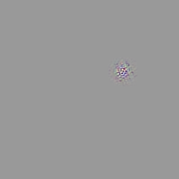
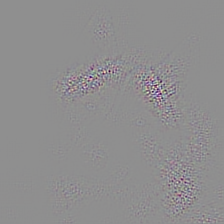
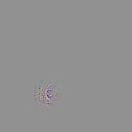
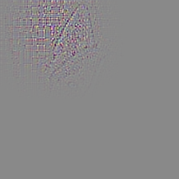
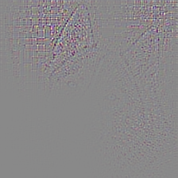
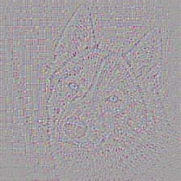
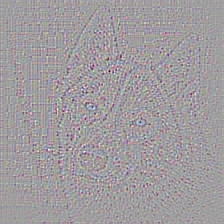
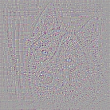

# Deconvnet
This is a implementation of Deconvnet in keras, following Matthew D.Zeiler's paper [Visualizing and Understanding Convolutional Networks](http://arxiv.org/pdf/1311.2901v3.pdf)

## Feature
Given a pre-trained keras model, this repo can visualize features of specified layer including dense layer.  

## Dependencies
* [Keras](https://github.com/fchollet/keras) 1.1
* Python >= 2.7
* argparse 1.0
* PIL 1.1

## Examples
Below is several examples of feature visualization based on pre-trained VGG16 in keras, 'max' means pick the greates activation in the feature map to be visualized and set other elements to zeros, 'all' mean use all values in the feature map to visualize.
* Original Image 

  
* block3_conv3_128

 &nbsp; &nbsp; &nbsp; &nbsp; 

* block4_conv2_46

 &nbsp; &nbsp; &nbsp; &nbsp; 

* block5_conv3_256

 &nbsp; &nbsp; &nbsp; &nbsp; 

* fc1_0 

* fc2_248 

* predictions_248 
predictions_248 is the predicted class of the image(label: Eskimo_dog) 

## Shortage
* The code implements visualize function for only Convolution2D, MaxPooling2D, Flatten, Input, Dense, Activation layers, thus cannot handle other type of layers.
* The code support only plain networks, thus cannot visualize ResNet, Highway Networks or something.
